# BLA VPN

A modern **Android Xray client** with Material 3 UI. Supports the same core features used by [v2rayN](https://github.com/2dust/v2rayN) / [v2rayNG](https://github.com/2dust/v2rayNG).

| Protocol | Transports | Security |
|----------|------------|----------|
| **VLESS** | TCP, WS, gRPC, HTTPUpgrade, **XHTTP**, KCP, QUIC, H2 | none, TLS, **REALITY** |
| **VMess** | same | TLS / REALITY |
| **Trojan** | same | TLS / REALITY |
| **Shadowsocks** | TCP | AEAD methods |
| Custom JSON | full Xray config | — |

### Features

- **VLESS + REALITY + Vision** (`flow: xtls-rprx-vision`)
- **XHTTP** transport, **uTLS** fingerprints
- **Mux**, domain sniffing, DoH DNS (through tunnel), optional FakeDNS
- Routing: Global · Bypass LAN · custom **direct domains** (wildcards)
- TLS fragment (anti-DPI)
- Quick Setup wizard, multi-select servers, subscriptions (traffic / expiry when provided)
- Session limits, keep-alive, optional **LAN proxy** for other devices
- Dual-accent **glass UI** (primary + secondary colors, compact custom HSV picker)
- Shield connect control; connected only after public IP + country resolve
- **In-app updates** from [GitHub Releases](https://github.com/davoodtaba-glitch/Bla-Vpn-pulse-/releases) + dashboard **NEW** badge
- Persian (فارسی) default UI + English
- Share-link import: `vless://`, `vmess://`, `trojan://`, `ss://`, subscription URLs

---

## Screenshots

<p align="center">
  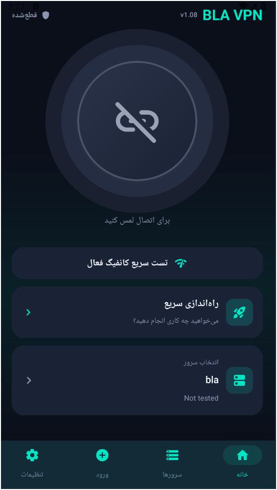
  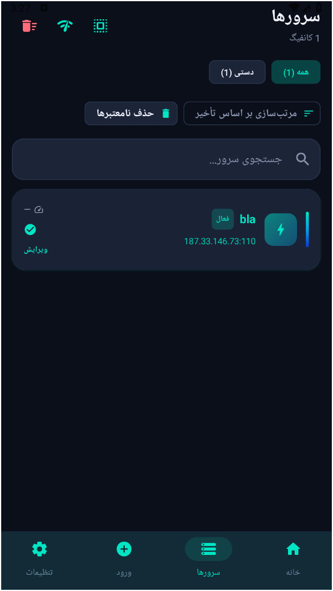
  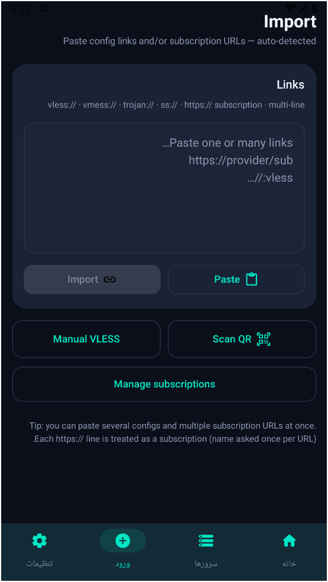
  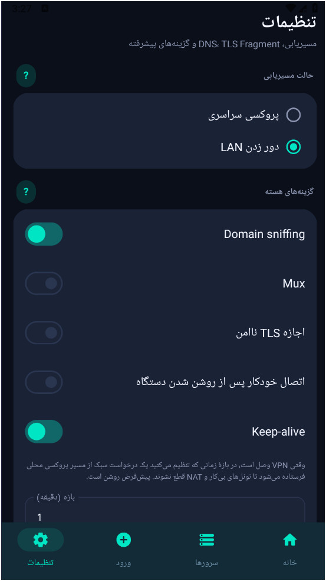
</p>
<p align="center">
  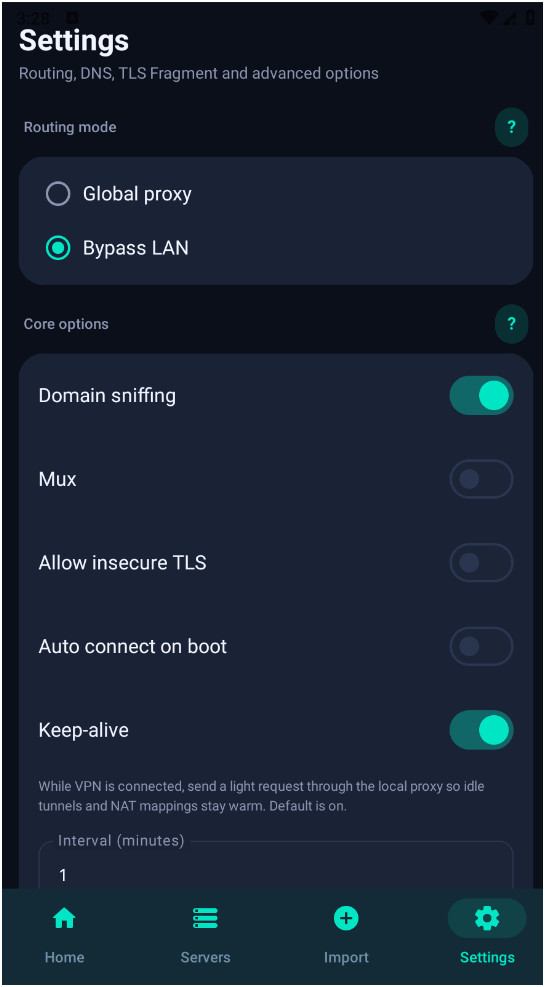
  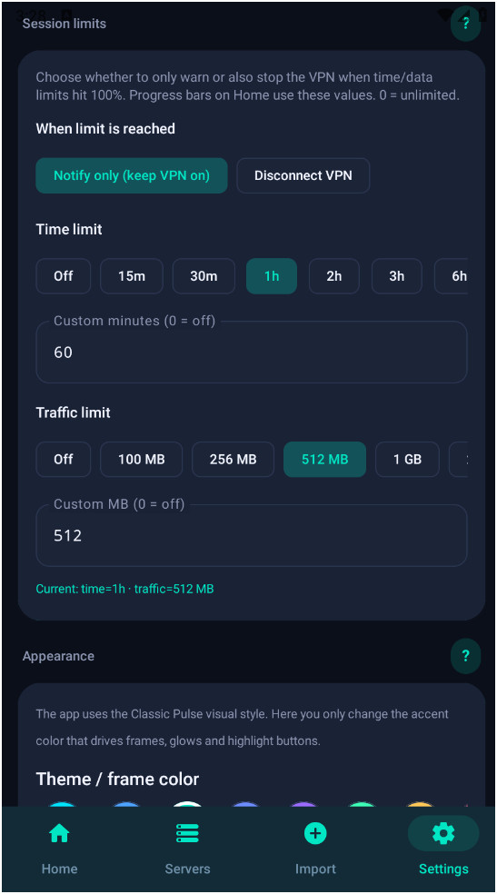
  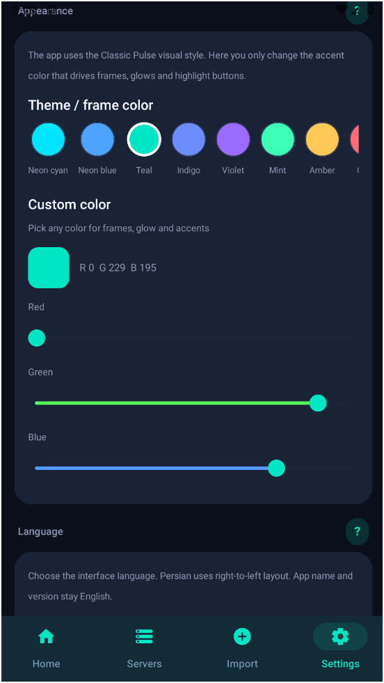
  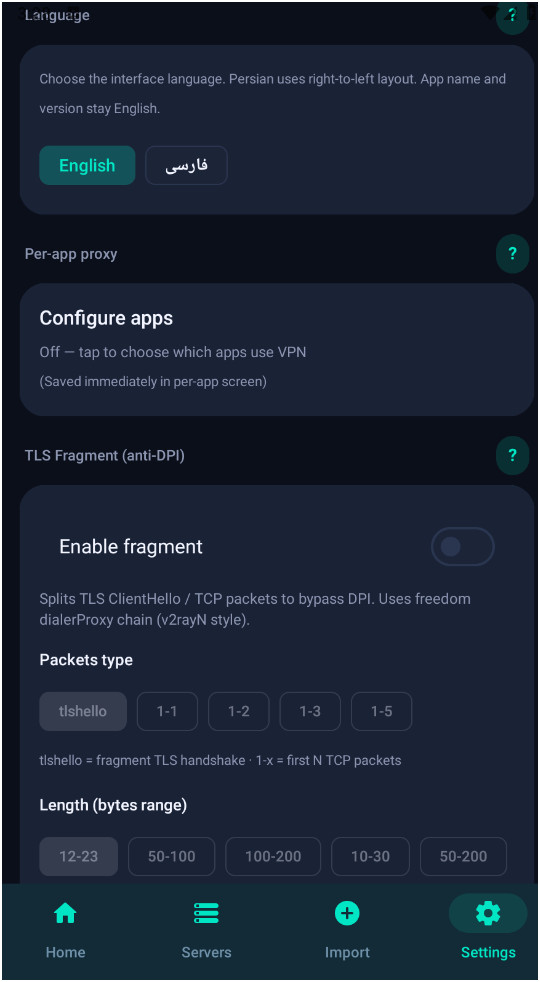
</p>
<p align="center">
  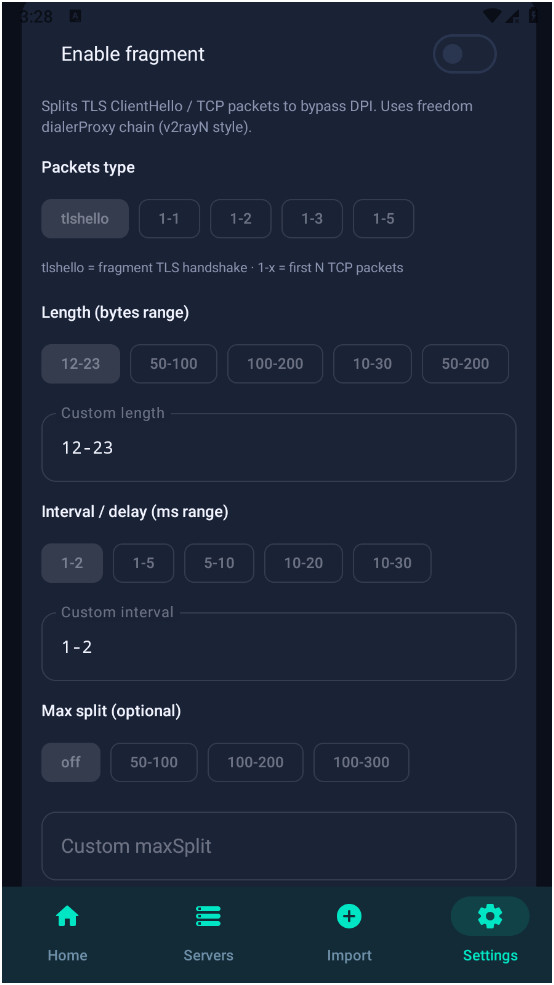
  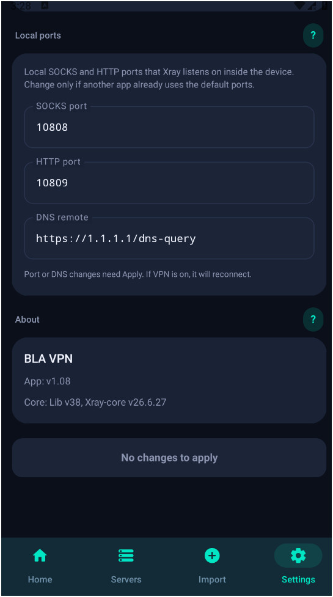
  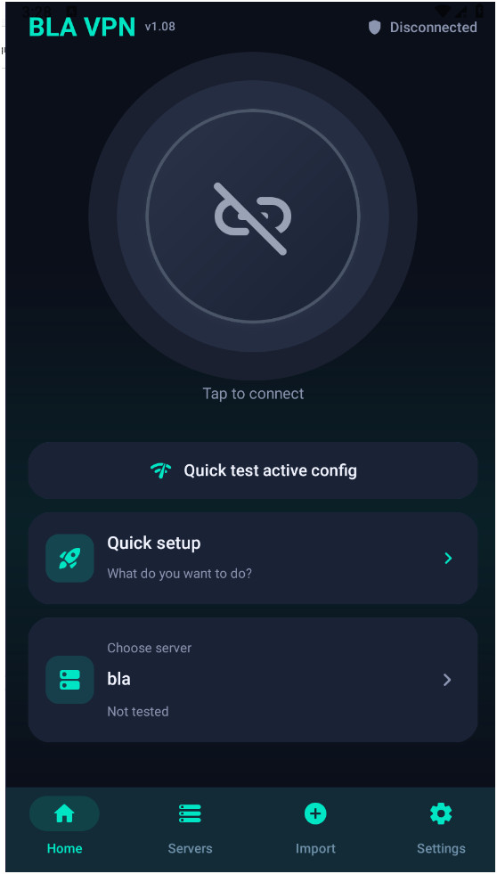
  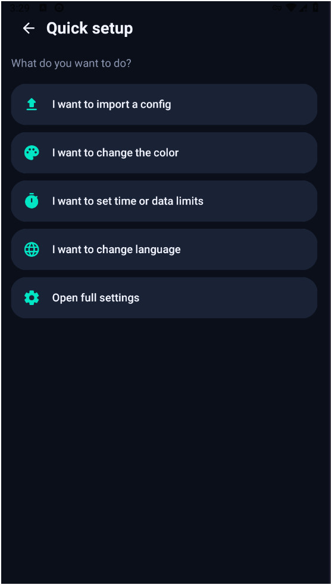
</p>
<p align="center">
  
  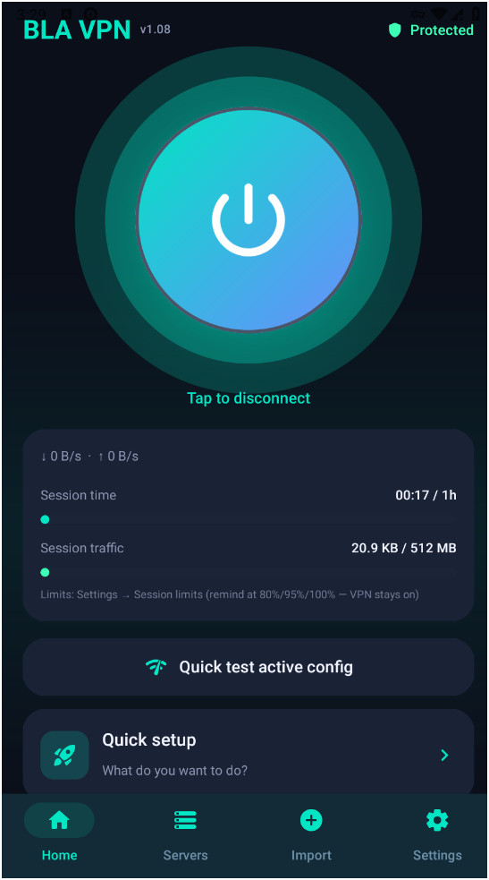
</p>

### Screens (overview)

- **Home** — shield connect, speeds, IP/country, update badge, subscription card  
- **Servers** — search, tabs per subscription, multi-select, latency  
- **Import** — links / multi-line paste, QR, manual VLESS  
- **Subscriptions** — refresh, rename, traffic / expire  
- **Settings** — routing, DNS presets, fragment, dual colors, language, About (update)  
- **Quick setup** — guided import / color / limits / language  

### Latest release

Install from **[Releases](https://github.com/davoodtaba-glitch/Bla-Vpn-pulse-/releases/latest)** (current: **v1.38+**).  
Inside the app: **Settings → About → Check for updates**, or use the home **NEW** badge when a newer build is published.

---

## Project structure

```
app/src/main/java/com/xraypulse/app/
  core/
    config/XrayConfigBuilder.kt
    parser/ShareLinkParser.kt
    parser/ShareLinkExporter.kt
    xray/XrayController.kt
    vpn/HevTunnel.kt
  service/XrayVpnService.kt
  data/
  ui/
```

---

## Build

### Requirements

- JDK 17+
- Android SDK (API 35 recommended)
- Gradle (wrapper included)

Create `local.properties` (not committed):

```properties
sdk.dir=/path/to/Android/Sdk
```

### Debug APK

```bash
./gradlew :app:assembleDebug
```

Output:

```
app/build/outputs/apk/debug/app-debug.apk
```

On Windows you can also use:

```powershell
.\scripts\build-debug.ps1
```

### Link Xray-core (required for real traffic)

Place `libv2ray.aar` from [AndroidLibXrayLite](https://github.com/2dust/AndroidLibXrayLite) into `app/libs/`.

**Linux / macOS / WSL**

```bash
chmod +x scripts/build-libxray.sh
./scripts/build-libxray.sh
```

**Manual**

```bash
git clone https://github.com/2dust/AndroidLibXrayLite.git
cd AndroidLibXrayLite
gomobile init
go mod tidy
gomobile bind -v -androidapi 24 -trimpath -ldflags='-s -w -buildid= -checklinkname=0' ./
cp libv2ray.aar /path/to/this-project/app/libs/
```

Optional geo databases:

```bash
# Windows PowerShell
./scripts/download-geo.ps1
```

### Install

```bash
./gradlew :app:assembleDebug
adb install -r app/build/outputs/apk/debug/app-debug.apk
```

Release APKs are published under [Releases](https://github.com/davoodtaba-glitch/Bla-Vpn-pulse-/releases).

---

## Usage

1. **Import** a share link or subscription URL (or use **Quick setup**).  
2. Select a server under **Servers**.  
3. On **Home**, tap connect and grant VPN permission.  
4. Configure **Settings** as needed (routing, fragment, ports, language).

Example VLESS + REALITY link:

```
vless://UUID@host:443?encryption=none&flow=xtls-rprx-vision&security=reality&sni=www.example.com&fp=chrome&pbk=PUBLIC_KEY&sid=SHORT_ID&type=tcp#MyServer
```

---

## Architecture notes

- Config generation follows current Xray JSON (`realitySettings`, `xhttpSettings`, Vision, hybrid domain matcher).  
- **XrayController** uses reflection so the project compiles without the AAR; with `libv2ray.aar` the real core is used.  
- **VPN path**: `VpnService` TUN + **hev-socks5-tunnel** (JNI) to local SOCKS.  
- Share formats align with **v2rayN / v2rayNG**.

---

## License

App code: MIT (this repository).  
Xray-core / AndroidLibXrayLite / hev-socks5-tunnel: their respective licenses.  
Use only with servers and networks you are authorized to access.

---

# BLA VPN — راهنمای فارسی

یک **کلاینت Xray اندروید** مدرن با رابط Material 3. امکانات اصلی هم‌راستا با [v2rayN](https://github.com/2dust/v2rayN) و [v2rayNG](https://github.com/2dust/v2rayNG) است.

| پروتکل | ترنسپورت | امنیت |
|--------|----------|--------|
| **VLESS** | TCP, WS, gRPC, HTTPUpgrade, **XHTTP**, KCP, QUIC, H2 | none, TLS, **REALITY** |
| **VMess** | همان | TLS / REALITY |
| **Trojan** | همان | TLS / REALITY |
| **Shadowsocks** | TCP | روش‌های AEAD |
| JSON سفارشی | کانفیگ کامل Xray | — |

### امکانات

- **VLESS + REALITY + Vision**
- ترنسپورت **XHTTP** و اثرانگشت **uTLS**
- **Mux**، sniffing دامنه، DoH از داخل تونل، FakeDNS اختیاری
- مسیریابی: Global · Bypass LAN · **دامنه‌های مستقیم** (با وایلدکارد)
- TLS fragment (ضد DPI)
- راه‌اندازی سریع، انتخاب چندتایی سرور، اشتراک (ترافیک / انقضا)
- محدودیت نشست، Keep-alive، پروکسی LAN
- ظاهر شیشه‌ای با **دو رنگ** (انتخاب سفارشی فقط با ضربه روی Custom)
- دکمه سپر؛ وضعیت «متصل» پس از دریافت IP و کشور
- **به‌روزرسانی داخل اپ** از [GitHub Releases](https://github.com/davoodtaba-glitch/Bla-Vpn-pulse-/releases) و نشان **جدید** در خانه
- زبان پیش‌فرض **فارسی** + English
- ورود لینک: `vless://`، `vmess://`، `trojan://`، `ss://` و URL اشتراک

---

## تصاویر صفحه (Screenshots)

<p align="center">
  
  
  
  
</p>
<p align="center">
  
  
  
  
</p>
<p align="center">
  
  
  
  
</p>
<p align="center">
  
  
</p>

## صفحات اپ

- **خانه** — سپر اتصال، سرعت، IP/کشور، نشان به‌روزرسانی، کارت اشتراک  
- **سرورها** — جستجو، تب هر اشتراک، انتخاب چندتایی، تأخیر  
- **ورود** — چسباندن لینک، QR، VLESS دستی  
- **اشتراک‌ها** — به‌روزرسانی، تغییر نام، ترافیک / انقضا  
- **تنظیمات** — مسیریابی، DNS، fragment، دو رنگ، زبان، درباره (آپدیت)  
- **راه‌اندازی سریع** — ورود هدایت‌شده / رنگ / محدودیت / زبان  

### آخرین نسخه

از **[Releases](https://github.com/davoodtaba-glitch/Bla-Vpn-pulse-/releases/latest)** نصب کنید.  
در اپ: **تنظیمات → درباره → بررسی به‌روزرسانی** یا نشان **جدید** در صفحه خانه.

---

## ساختار پروژه

```
app/src/main/java/com/xraypulse/app/
  core/
    config/XrayConfigBuilder.kt
    parser/ShareLinkParser.kt
    parser/ShareLinkExporter.kt
    xray/XrayController.kt
    vpn/HevTunnel.kt
  service/XrayVpnService.kt
  data/
  ui/
```

---

## ساخت (Build)

### پیش‌نیاز

- JDK 17 یا بالاتر  
- Android SDK (ترجیحاً API 35)  
- Gradle (wrapper داخل پروژه)

فایل `local.properties` را بسازید (در گیت commit نمی‌شود):

```properties
sdk.dir=/path/to/Android/Sdk
```

### APK دیباگ

```bash
./gradlew :app:assembleDebug
```

خروجی:

```
app/build/outputs/apk/debug/app-debug.apk
```

در ویندوز می‌توانید از اسکریپت هم استفاده کنید:

```powershell
.\scripts\build-debug.ps1
```

### اتصال هسته Xray (برای ترافیک واقعی لازم است)

فایل `libv2ray.aar` را از [AndroidLibXrayLite](https://github.com/2dust/AndroidLibXrayLite) در پوشه `app/libs/` قرار دهید.

**لینوکس / مک / WSL**

```bash
chmod +x scripts/build-libxray.sh
./scripts/build-libxray.sh
```

**دستی**

```bash
git clone https://github.com/2dust/AndroidLibXrayLite.git
cd AndroidLibXrayLite
gomobile init
go mod tidy
gomobile bind -v -androidapi 24 -trimpath -ldflags='-s -w -buildid= -checklinkname=0' ./
cp libv2ray.aar /path/to/this-project/app/libs/
```

دانلود اختیاری geo:

```bash
./scripts/download-geo.ps1
```

### نصب

```bash
./gradlew :app:assembleDebug
adb install -r app/build/outputs/apk/debug/app-debug.apk
```

نسخه‌های release در بخش [Releases](https://github.com/davoodtaba-glitch/Bla-Vpn-pulse-/releases) منتشر می‌شوند.

---

## نحوه استفاده

1. یک لینک اشتراک یا `vless://…` را **وارد** کنید (یا از **راه‌اندازی سریع**).  
2. در **سرورها** یک سرور را انتخاب کنید.  
3. در **خانه** دکمه اتصال را بزنید و مجوز VPN را بدهید.  
4. در **تنظیمات** در صورت نیاز مسیریابی، fragment، پورت و زبان را تنظیم کنید.

نمونه لینک VLESS + REALITY:

```
vless://UUID@host:443?encryption=none&flow=xtls-rprx-vision&security=reality&sni=www.example.com&fp=chrome&pbk=PUBLIC_KEY&sid=SHORT_ID&type=tcp#MyServer
```

---

## نکات معماری

- ساخت کانفیگ مطابق JSON فعلی Xray.  
- **XrayController** با reflection کار می‌کند تا بدون AAR هم کامپایل شود؛ با `libv2ray.aar` هسته واقعی استفاده می‌شود.  
- مسیر VPN: TUN از `VpnService` + **hev-socks5-tunnel** به SOCKS محلی.  
- فرمت لینک‌ها با **v2rayN / v2rayNG** سازگار است.

---

## مجوز

کد اپ: MIT (این مخزن).  
Xray-core / AndroidLibXrayLite / hev-socks5-tunnel: مجوزهای مربوط به خودشان.  
فقط روی سرور و شبکه‌ای استفاده کنید که مجاز هستید.
